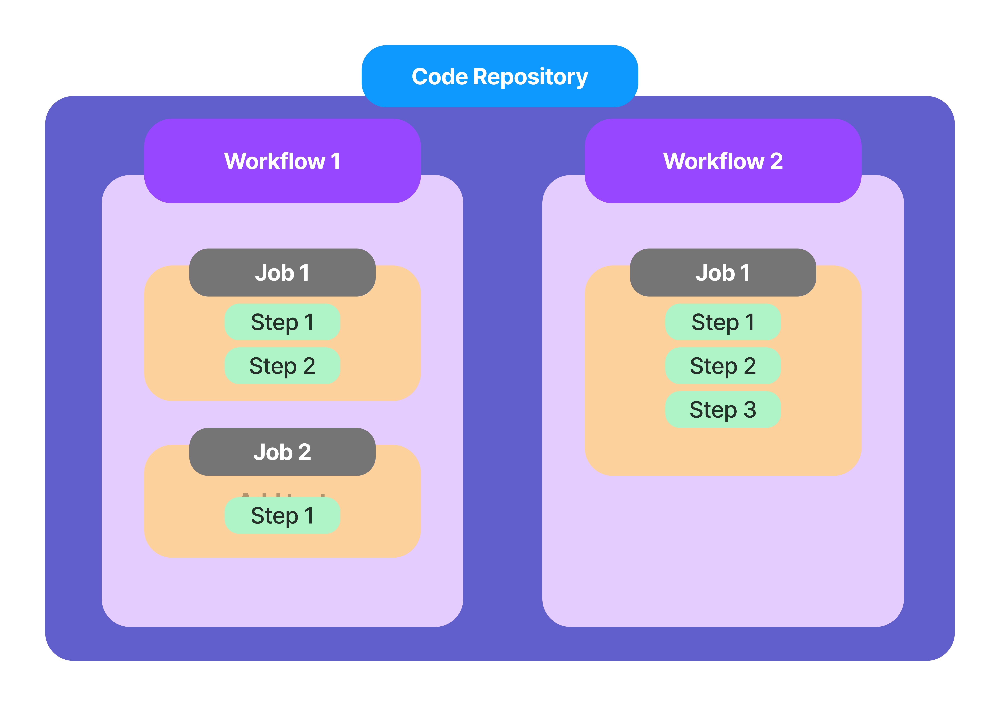

## Table of Contents
Github actions deep dive workshop from zero to hero


- [Git Basic commands](#git-basic-commands)
- [Github actions basic](#github-action-basic)
- [Github actions building blocks](#github-actions-building-blocks)
- [Github actions Workflows and Events](#github-actions-workflows-and-events)
- [Github actions job artifacts and outputs](#github-actions-job-artifacts-and-outputs)
- [Github actions using variables and secrets](#github-actions-using-variables-and-secrets)
- [Github actions Controlling Workflow and Job execution](#github-actions-controlling-workflow-and-job-execution)
- [Github actions Jobs and Docker Containers](#github-actions-jobs-and-docker-containers)
- [Github actions Using custom actions](#github-actions-using-custom-actions)
- [Github actions deploy terraform script to Azure cloud](#github-actions-deploy-terraform-to-azure-cloud)
- [Github actions deploy bicep script to Azure cloud](#github-actions-deploy-terraform-to-azure-cloud)


## Git Basic Commands
After installing Git, you can also configure it - most importantly, you can set a username and email address that will be connected to all your code snapshots.

You can learn more about Git's configuration options here: 
https://docs.craft.do/editor/d/93958d6f-1340-6147-fc3c-1be83d5bfef9/FE067BAC-75E9-40A9-9280-5125A1823AB4/b/7DF294EA-9ABC-40FD-8DD5-E9527B89FF29#50E78A39-91C6-4063-87FA-104A42C4C8BE


```bash
git config --global user.name "your-username"
git config --global user.email "your-email"
```

```bash
git init # Create git directory 
git add <file(s)> # Stage changes for next commit 
git add . # Add all files
git commit -m "message" # Create a commit that includes all stages changes 
git log # show the Head and commit history
git status # get the current repository status
git checkout <id> # Move between commits 
git checkout main # Go to latest commit in main branch 
```

### Reverting changes with "git revert"
```bash
git revert <id> # Undo Commits - Revert changes of commit by creating a new commit 
```

### Resetting code with "git reset"
```bash
git reset --hard <id> # Undo changes by deleting all commits since <id>
```

### Branches
```bash
git branch <name> # Create a new branch 
git branch -b <branch-name> # Create a new branch and checkout to newly created branch 
git checkout <branch-name> # Move to new created branch 
git branch -D <branch-name> # Delete branch 
git branch # See all branches
git merge <name> # Merge branches
# Merge from feature branch to main branch 
git checkout main 
git merge feature-restructure 
git branch -D feature-restucture # delete the feature branch
```


### Forks 
You can fork the repository and then pull request between different repositories, You need to create a pull request from the original repository and connect to your forked repository.


## GitHub actions basic

- In public repositories, you can use GitHub Actions for free. For private repositories, only a certain amount of monthly usage is available for free - extra usage on top must be paid. 
- The exact quotas and payment details depend on your GitHub plan, a detailed summary can be found here: https://docs.github.com/en/billing/managing-billing-for-github-actions/about-billing-for-github-actions
- If you can't find an "Actions" tab in your GitHub repository, you can should enable them as described here: https://docs.github.com/en/repositories/managing-your-repositorys-settings-and-features/enabling-features-for-your-repository/managing-github-actions-settings-for-a-repository




  
  
    
  

### First Workflow


```yaml
name: First Workflow
on: workflow_dispatch # manually trigger the workflow

jobs:
  first-job:
    runs-on: ubuntu-latest
    steps:
      - name: Print greeting 
        run: echo "Hello World"
      - name: Print goodbye
        run: echo "Done - bye"
```

If you need to run multiple shell commands (or multi-line commands), you can easily do so by adding the pipe symbol ( | ) as a value after the run: key.  

Example:  
```yaml
...
run: |
    echo "First output"
    echo "Second output"
```


